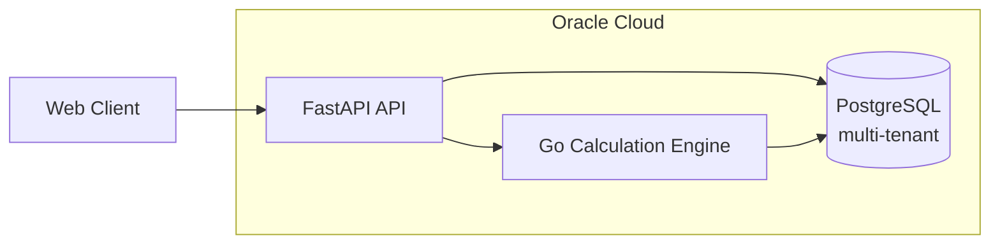
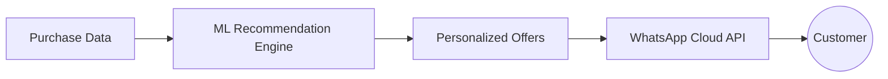
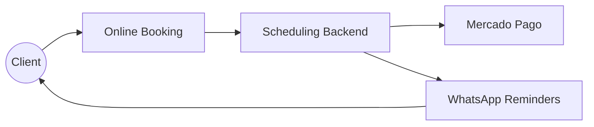

<!-- ============ HEADER ============ -->
<p align="center">
  
</p>

<p align="center">
  <a href="https://readme-typing-svg.demolab.com">
    
  </a>
</p>

<p align="center">
  <a href="https://www.linkedin.com/in/franciscotomasmateos/">
    
  </a>
  <a href="mailto:f.tomasmateos@gmail.com">
    
  </a>
  
  
</p>

---

## 👨‍💻 About me

Software Engineer based in **Córdoba, Argentina 🇦🇷**, finishing my **Systems Engineering** degree at Universidad Católica de Córdoba (graduating December 2026). I build backend systems and data infrastructure: real-time processing, analytics APIs, and cloud-native services on AWS. My time working on metrics and analytics sparked a strong passion for **Data Engineering**, which is where I'm steering my career.

```python
class FranciscoMateos:
    location   = "Córdoba, Argentina 🇦🇷"
    role       = "Software Engineer"
    focus      = ["Backend Architecture", "Data Engineering", "Distributed Systems"]
    cloud      = ["AWS", "Oracle Cloud"]
    english    = "Cambridge B2 (FCE) · C1 academic"
    hobbies    = ["Code", "Learn", "Architecture Design", "Motorsports 🏎️", "Mate 🧉"]

    def currently(self):
        return [
            "🛠️ Freelance @ Hyper100: custom CRM (backend + frontend)",
            "🎓 Final year of Systems Engineering @ UCC",
            "📊 Going deeper into Data Engineering",
        ]
```

---

## 🛠️ Tech Stack

<p align="center">
  <b>Languages & Backend</b><br><br>
  
</p>

<p align="center">
  <b>Databases & Caching</b><br><br>
  
</p>

<p align="center">
  <b>Cloud & DevOps</b><br><br>
  
</p>

<p align="center">
  <b>Frontend</b><br><br>
  
</p>

---

## 🚀 Featured Projects

### 🛞 Rodacore
Multi-tenant SaaS for **fleet tire management** and cost optimization.
`FastAPI` · `PostgreSQL` · `Go` · `Oracle Cloud`



### 🎯 SmartOffer
**Personalized promotions** and recommendation engine for retail, powered by Machine Learning, with direct integration with **Meta's WhatsApp Cloud API**.
`Python` · `Machine Learning` · `WhatsApp Cloud API`



### 💆 MiKangu
Online **scheduling and management platform** for aesthetic centers, with automated WhatsApp reminders and full **Mercado Pago** integration for payments.
`Python` · `WhatsApp Cloud API` · `Mercado Pago`



---

## 📊 GitHub Stats

<p align="center">
  
  
</p>

<p align="center">
  
</p>

<p align="center">
  
</p>

<p align="center">
  
</p>

---

## 🐍 Contribution Snake

<p align="center">
  <picture>
    <source media="(prefers-color-scheme: dark)" srcset="https://raw.githubusercontent.com/frantmateos/frantmateos/output/github-snake-dark.svg" />
    <source media="(prefers-color-scheme: light)" srcset="https://raw.githubusercontent.com/frantmateos/frantmateos/output/github-snake.svg" />
    
  </picture>
</p>

---

## 🤝 Let's connect

I'm looking for **part-time remote roles (~20 hs/week)** with international early-stage startups, with a move to full-time after graduation. If you're building something interesting around backend or data, let's talk.

<p align="center">
  <a href="https://www.linkedin.com/in/franciscotomasmateos/">LinkedIn</a> ·
  <a href="mailto:f.tomasmateos@gmail.com">f.tomasmateos@gmail.com</a>
</p>

<p align="center">
  
</p>
